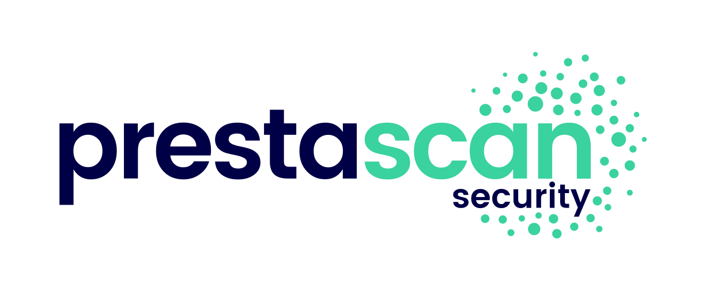
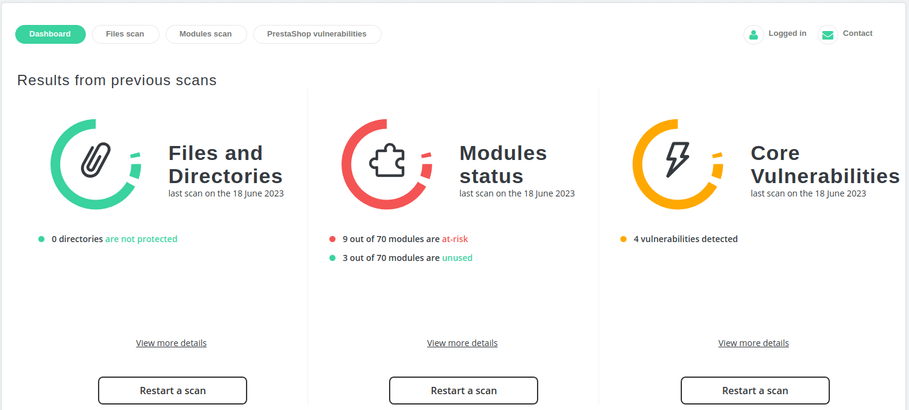

<p align="center">
    
</p>

:gb: **PrestaScan Security** is a PrestaShop module allowing you to scan your PrestaShop website to identify malware and known vulnerabilities in PrestaShop core and modules.  
**Learn more on**: https://www.profileo.com/en/prestascan-security

:fr: **PrestaScan Security** est un module PrestaShop vous permettant de scanner votre site PrestaShop afin d'identifier les malwares et les vulnérabilités connues dans le cœur de PrestaShop et ses modules.  
**En savoir plus sur** : https://www.profileo.com/fr/prestascan-security


[:floppy_disk: Download latest version](https://security.prestascan.com/prestashop)

## Table of contents
* [General Information](#general-information)
* [Features](#features)
* [Contributing](#contributing)
* [Reporting Security Issues](#reporting-security-issues)
* [Technical notes](#technical-notes)
* [License](#license)

## General Information

<p align="center">
    
</p>

**PrestaScan Security** is a free and open-source module that helps you secure your PrestaShop website by identifying malware and known vulnerabilities in the PrestaShop core and modules. The module is easy to install and use, and it keeps you updated on the latest security threats to your website. It is compatible with PrestaShop 1.5, 1.6, 1.7, and 8. Our team of security experts constantly monitors and audits modules to ensure the best protection for your online store.

This module is fueled by the collective energy of the members of the Friends Of Presta security cell. Here is the list of the most significant contributors in terms of security research, publication of CVE, or development:

<p align="center">
    <a href="https://www.touchweb.fr/" target="_blank"></a>&nbsp;&nbsp;&nbsp;&nbsp;
    <a href="https://www.profileo.com/" target="_blank"></a>&nbsp;&nbsp;&nbsp;&nbsp;
    <a href="https://www.202-ecommerce.com/" target="_blank"></a>&nbsp;&nbsp;&nbsp;&nbsp;
    <a href="https://www.772424.com/" target="_blank"></a>&nbsp;&nbsp;&nbsp;&nbsp; 
    <a href="https://friends-of-presta.github.io/security-advisories/" target="_blank"></a>
</p>

### Is the module free?

Yes, the module is **free** and **open source**.

### How to install the module?

You will find the zip of the module in the release section of the GitHub. You then need to install this zip in your back office.<br>
You may contact your agency/developer in order to get support to install the module, however, no configurations or technical knowledge is required to install it.

### How to use the module?

Once installed, access the module configuration, and you will be guided in order to run your scans.

### How to update the module?

When an update is available, a notification will be displayed in your back office.<br>
It's required to keep the latest version of the module in order to perform new scans.

### How does module vulnerability alerts work?

When a vulnerability is discovered and publicly revealed or known to be exploited, then a security notification is sent to all users that have done at least one scan of module vulnerabilities in the module. Make sure to run your scan at least once.<br>

Our team is regularly auditing modules in order to detect and alert on security issues.<br>
We are also relying on external publication data (such as CVE) and the work of partner agencies and [Friends of Presta security team](https://friendsofpresta.org/fr/fop-security).

### Are there paid plans or limitations?

The module will always remain free. It's part of our DNA.<br>
On the other hand, the cost of the development of the module has been significant, and we need to maintain a server environment up and running. In order to maintain this tool and to ensure that our security team keeps updating and improving the solution, we will introduce paid plans as soon as more functionalities are released in the module. Paid plans will unlock specific features such as the automation of scans and reduce some limitations (number of scans that can be performed on a specific timeframe, for example). The module will remain free and the service will still be working for users without a paid plan. At the moment, no paid plans are defined yet, but ads from partners might be displayed from time to time.

### Compatibility

As the security targets all kinds of merchants, using sometimes outdated versions of PrestaShop, we do our best for the moment to keep the module at least compatible with PrestaShop 1.5, 1.6, 1.7, and 8.

| PrestaShop version tested | Status | Comments |
| -------- | ------ | ------ |
| **8.X** (8.1.5) | :heavy_check_mark: | Stable
| **1.7.X** (1.7.8.8) | :heavy_check_mark: | Stable
| **1.6.1.X** (1.6.1.24) | :heavy_check_mark: | Stable
| **1.6.0.X** (1.6.0.9) | :heavy_check_mark: | Stable
| **1.5** | :heavy_check_mark: | Stable (but will not be actively maintained)

## Features

- [x] Scan your modules to identify vulnerabilities and required updates
- [x] Identify unused modules, with the ability to disable and remove modules in one place
- [x] Be alerted :warning: when a new vulnerability is discovered in your module (including back office)
- [x] List known vulnerabilities in PrestaShop Core for your current version
- [x] List unprotected directories
- [x] Email notification when a new vulnerability is discovered

### Exciting upcoming features !
- [ ] BackOffice alert notifications when a new PrestaShop core vulnerability is discovered
- [ ] Perform scans of your files to detect known malware or suspicious patterns
- [ ] List all modified and added files
- [ ] List non-standard files, such as zip files or database export
- [ ] Automated scans :tada:
- [ ] Allowing other data sources (to improve open-source development)
- [ ] Ability to control the level of notification

And much more to come...

## Contributing

We welcome contributions to this project from the community. If you would like to contribute, please follow these steps:

1. Fork the repository and clone it to your local machine.
2. Create a new branch for your changes and check out that branch.
3. Make your changes to the code and ensure that they meet the project's coding standards.
4. Create a pull request to submit your changes to the project. Be sure to include a clear description of the changes you have made and any relevant details about the changes.
5. Wait for feedback from the project maintainers. They may request changes or provide feedback on how to improve the changes.
6. Once your changes have been approved, they will be merged into the project.

### Coding standards

This project follows the [PSR-2](https://www.php-fig.org/psr/psr-2/) coding standard for PHP code. If you are making changes to the PHP code in this project, please ensure that your changes adhere to this standard. We additionally make our best to follow [PrestaShop coding standards](https://devdocs.prestashop-project.org/8/development/coding-standards/)

## Reporting Security Issues

If you discover a security issue in this project, please report it to us as soon as possible. We take security issues very seriously and will work to address any vulnerabilities in a timely manner.

To report a security issue, please follow these steps:

1. Contact us directly at <security@prestascan.com>.
2. Provide as much detail about the issue as possible, including steps to reproduce the issue, if possible.
3. Do not disclose the issue publicly until we have had a chance to investigate and address the issue.

Once we receive your report, we will investigate the issue and work to develop a fix. We will also work with you to ensure that the issue is not disclosed publicly until we have had a chance to address it.

We appreciate your help in keeping this project secure and protecting the privacy and security of our users.

## Technical notes

### Usage of composer

This module was relying first on [Oauth2-client](https://github.com/thephpleague/oauth2-client/releases) package.
However, the package requires `guzzlehttp/guzzle ^6.0`
Unfortunately, PrestaShop Core (1.7.8.8, to date) is including an old version of guzzle `guzzlehttp/guzzle: ^5.3`
For this reason, we either had to include `vendor-static` and rename Guzzle classes to be compatible with Oauth2-client (which is not really clean), or to develop our own simple Oauth2 Client (which we have done here).

### Developing locally

If you intend to run the module locally, you won't be able to communicate with Profileo's servers to conduct the scan. This is because scans operate asynchronously, and results are sent via webhooks that can't target a local domain. Therefore, you'll need to use a mock server to simulate server responses and operate your own server. Additionally, specify your server's URLs using the following GET parameters, which will ensure OAuth2 authentication and scans function correctly in the designated environment.
The following GET parameters are used before login with Oauth2 :
```
&devdomainurl={your_url}
&devredirecturl={your_url}
```
In local environments using docker, you may for example have:
```
&devdomainurl=http://127.0.0.1/&devredirecturl=http://prestascansecurity_server-laravel.test-1/
```

### Data processing and connections

The module is communicating with our server (hosted by [772424.com](https://www.772424.com/)) to perform the different scans.<br>
For this reason and security reasons (in order to generate secure tokens), you are therefore required to create an account in our system.<br>
The data we are collecting at this time are:
- Data provided during registration (such as your name, shop url, etc..)
- The list of modules on your site
- The list of directories in your root directory
- Your PrestaShop version
- Other data will be provided for upcoming features, such as the name and path of the files to be scanned 

We do not send the content of your files to our server. Scans of the files will be performed locally.<br>

### Customize the contact-us URL

As an agency, you may replace the `/install/custom_config.php` file is order to set your own contact-us or ticket system URL.

## Acknowledgements

Data used for the modules vulnerabilities scans are historically coming from forensic analysis by [Profileo](https://www.profileo.com/) and [772424.com](https://www.772424.com/).<br>
They are now completed with [CVE discoveries](https://www.cve.org/ResourcesSupport/FAQs), actively monitored and contributed by [Friends Of Presta](https://github.com/friends-of-presta/security-advisories).

We thank all partner agencies for their work releasing security advisories.<br>

## License

This project is licensed under the Apache License, Version 2.0.
The full text of the license is included in the file [`LICENSE`](./LICENSE).
A [`AUTHORS`](./AUTHORS) file in the root directory of this project lists all authors and contributors of this project.
A [`NOTICE`](./NOTICE) file in the root directory of this project provides attribution notices for any third-party software or content that is included in this project. Please update the `NOTICE` file to acknowledge any external contributions to this project.

Include a reference to the license in the header of each source code file in your project. Here is an example header for a PHP file:

```php
<?php
/**
 * Copyright 2023 Profileo Group <contact@profileo.com> (https://www.profileo.com/fr/)
 *
 * For questions or comments about this software, contact Maxime Morel-Bailly <security@prestascan.com>
 * List of required attribution notices and acknowledgements for third-party software can be found in the NOTICE file.
 *
 * Licensed under the Apache License, Version 2.0 (the "License");
 * you may not use this file except in compliance with the License.
 * You may obtain a copy of the License at
 *
 *     http://www.apache.org/licenses/LICENSE-2.0
 *
 * Unless required by applicable law or agreed to in writing, software
 * distributed under the License is distributed on an "AS IS" BASIS,
 * WITHOUT WARRANTIES OR CONDITIONS OF ANY KIND, either express or implied.
 * See the License for the specific language governing permissions and
 * limitations under the License.
 *
 * @author    Profileo Group - Complete list of authors and contributors to this software can be found in the AUTHORS file.
 * @copyright Since 2023 Profileo Group <contact@profileo.com> (https://www.profileo.com/fr/)
 * @license   https://www.apache.org/licenses/LICENSE-2.0 Apache License, Version 2.0
 */
```

For more information about using the Apache License, Version 2.0, please see the `LICENSE.md` file or visit the following URL:
http://www.apache.org/licenses/LICENSE-2.0
